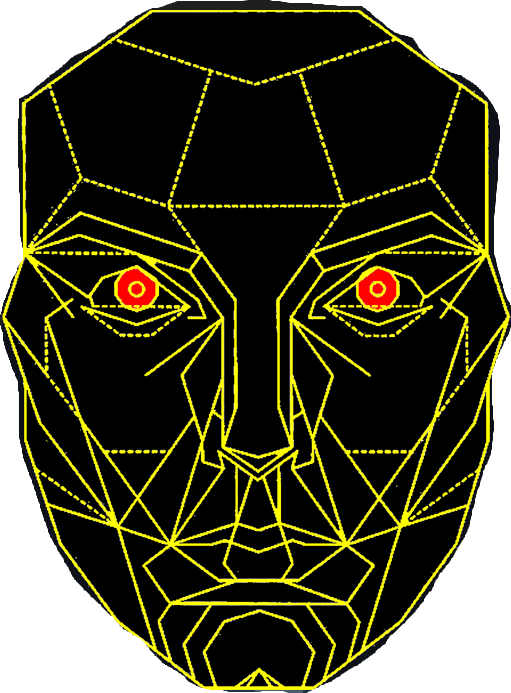

    <h1  align="center" >Facial Expression Recognition on Video and Image 📷</h1>

## INTRODUCTION

   

An emotion classification project which takes image files captured from human face and predicts the emotion conveyed from the facial expression. Please visit the application [here](https://fervi.herokuapp.com/) to explore the project and its capabilities including real-time video emotion classification and real-time graphs.

## DATASETS USED

1. [FER2013](https://www.kaggle.com/datasets/deadskull7/fer2013)
    
   
The data consists of 48x48 pixel grayscale images of faces. The faces have been automatically registered so that the face is more or less centered and occupies about the same amount of space in each image. The seven categories in the dataset are: (0=Angry, 1=Disgust, 2=Fear, 3=Happy, 4=Sad, 5=Surprise, 6=Neutral). The data set has three columns: "emotion", "pixels", and "Usage". The "emotion" column contains a numeric code ranging from 0 to 6, inclusive, for the emotion that is present in the image. The "pixels" column contains a string surrounded in quotes for each image. The contents of this string a space-separated pixel values in row major order. The "Usage" column indicates which images are for Training(80%), Public Test(10%), and Private Test(10%). This dataset ontains 35,887 images. This dataset was prepared by Pierre-Luc Carrier and Aaron Courville, as part of an ongoing research project. They have graciously provided the workshop organizers with a preliminary version of their dataset to use for this contest.

2. [The Extended Cohn-Kanade Dataset (CK+)](https://www.kaggle.com/datasets/davilsena/ckdataset)
    
   
This dataset contains 920 images from 920 original CK+ dataset. Data is already reshaped to 48x48 pixels, in grayscale format and facecropped using haarcascade_frontalface_default. Noisy (based on room light/hair format/skin colour) images were adapted to be clearly identified using Haar classifier. Columns from file are defined as emotion/pixels/Usage. Emotions are defined as:
   
   0 : Anger     (45 samples)

   1 : Disgust   (59 samples)

   2 : Fear      (25 samples)

   3 : Happiness (69 samples)

   4 : Sadness   (28 samples)

   5 : Surprise  (83 samples)

   6 : Neutral   (593 samples)

   7 : Contempt  (18 samples)
   
   Pixels contains 2304 pixels (48x48) each row.
   
   Usage is determined as Training(80%) / PublicTest(10%) / PrivateTest(10%).
   
   This dataset was first developed to make a comparison to [ROHIT VERMA - FER2013].

## TECHNOLOGIES

1. [Tensorflow](https://www.tensorflow.org/)
2. [Keras](https://keras.io/)
3. [Scikit-Learn](https://scikit-learn.org/stable/)
4. [Numpy](https://numpy.org/)
5. [Pandas](https://pandas.pydata.org/)
6. [Imbalanced-Learn](https://imbalanced-learn.org/stable/index.html)
7. [Plotly](https://plotly.com/)
8. [Matplotlib](https://matplotlib.org/)
9. [Seaborn](https://seaborn.pydata.org/)
10. [Jupyter Notebook](https://jupyter.org/)
11. [OpenCV](https://opencv.org/)
12. [Python](https://www.python.org/)
13. [Flask](https://flask.palletsprojects.com/en/2.3.x/)
14. [HTML](https://developer.mozilla.org/en-US/docs/Web/HTML)
15. [CSS](https://developer.mozilla.org/en-US/docs/Web/CSS)
16. [JavaScript](https://developer.mozilla.org/en-US/docs/Web/JavaScript)
17. [Heroku](https://www.heroku.com/)
18. [Kaggle](https://www.kaggle.com/)

## UI

   

## NOTEBOOK VIEWER LINK

You can check the Jupyter Notebook for all the workings of the model [here](https://nbviewer.org/github/GeorgiosIoannouCoder/fervi/blob/main/fervi-notebook.ipynb).

## SETUP INSTRUCTIONS

You can view all the setup instructions depening on your operating system in the setup folder [here](https://github.com/GeorgiosIoannouCoder/fervi/tree/main/setup).

## CONTRIBUTION AND FEEDBACK

If you would like to contribute or have any feedback for this project please feel free to contact me on [LinkedIn](https://www.linkedin.com/in/georgiosioannoucoder/).

## CODE LICENSE

MIT License

Copyright (c) 2023 Georgios Ioannou

Permission is hereby granted, free of charge, to any person obtaining a copy
of this software and associated documentation files (the "Software"), to deal
in the Software without restriction, including without limitation the rights
to use, copy, modify, merge, publish, distribute, sublicense, and/or sell
copies of the Software, and to permit persons to whom the Software is
furnished to do so, subject to the following conditions:

The above copyright notice and this permission notice shall be included in all
copies or substantial portions of the Software.

THE SOFTWARE IS PROVIDED "AS IS", WITHOUT WARRANTY OF ANY KIND, EXPRESS OR
IMPLIED, INCLUDING BUT NOT LIMITED TO THE WARRANTIES OF MERCHANTABILITY,
FITNESS FOR A PARTICULAR PURPOSE AND NONINFRINGEMENT. IN NO EVENT SHALL THE
AUTHORS OR COPYRIGHT HOLDERS BE LIABLE FOR ANY CLAIM, DAMAGES OR OTHER
LIABILITY, WHETHER IN AN ACTION OF CONTRACT, TORT OR OTHERWISE, ARISING FROM,
OUT OF OR IN CONNECTION WITH THE SOFTWARE OR THE USE OR OTHER DEALINGS IN THE
SOFTWARE.
